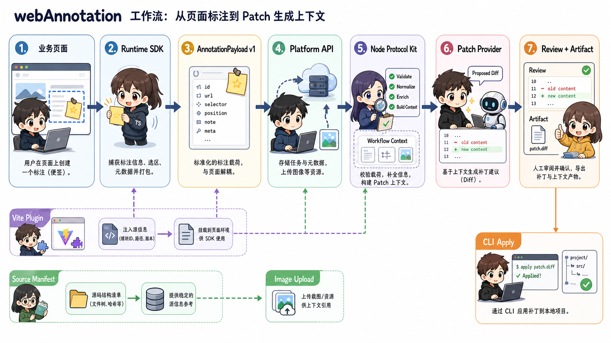

# webAnnotation

> 默认语言：简体中文。英文原文保留在文末折叠区，便于对照。

AI-first 的 Web 标注工具集，用来把页面反馈转换成结构化的代码修改上下文。

`webAnnotation` 让宿主 Web 应用进入标注模式：用户可以选择 DOM 元素、填写反馈、提交 `AnnotationPayload v1` 到配置好的后端。项目长期目标是把这些 payload 连接到 AI 补丁生成、PR/MR review，以及本地 CLI 应用补丁流程。

> 状态：早期 MVP 开发中。当前仓库已经包含 Runtime SDK、React 源码元数据 Vite 插件、Node 协议包、CLI 和本地示例。可发布包已在 npm 上提供 `0.1.0` 版本。`apps/platform-starter` 和 `examples/*` 包是私有示例/应用，不会发布。

## 功能流程调用图



调用主链路：业务页面挂载 `Runtime SDK` 创建标注，`@web-annotation/vite`
在构建期注入源码元数据，SDK 组装 `AnnotationPayload v1` 后提交给
`Platform API`；平台侧通过 `@web-annotation/node` 校验、补全 source
manifest、构建 patch prompt context，并在需要时收集仓库源码片段；随后
`Patch Provider` 生成补丁建议，人工 review 后导出 patch artifact，最后由
`@web-annotation/cli` 在本地执行 dry-run/check/apply/branch commit 流程。

## 当前 MVP

仓库当前包含：

- `@web-annotation/core`：浏览器 Runtime SDK。
- `@web-annotation/vite`：面向 React JSX/TSX 源码元数据的 Vite 插件。
- `@web-annotation/node`：Node 侧协议包，用于 payload 校验和 AI patch 上下文构建。
- `apps/platform-starter`：最小 HTTP 接入 API，包含双语静态任务控制台；它会校验 payload、存储任务、收集仓库源码上下文，并提出 mock patch。
- `examples/playground`：用于本地验证的最小 Vite 页面。
- `examples/vite-react`：React + Vite 示例，展示 DOM 到源码 payload。
- `examples/provider-http-mock`：可运行的 HTTP patch-provider 参考实现和端到端 smoke test。
- TypeScript 类型检查、单元测试和构建脚本。

Runtime SDK 当前支持：

- `createAnnotator(options)`。
- `enable()`、`disable()`、`isEnabled()`、`mountWidget()`、`destroy()`。
- hover 高亮和点击锁定目标元素。
- 锁定元素旁边的小型浮动 textarea。
- `Enter` 提交、`Shift+Enter` 换行、`Esc` 取消。
- `submitAnnotation(payload)` 自定义提交。
- `endpoint` 加可选 `getAuthToken()` 的 POST 提交。
- `AnnotationPayload v1`，包含项目、页面、目标 selector、CSS path、元素文本、rect 和清洗后的 DOM snapshot。
- 当 Vite 插件注入源码元数据时，支持可选 `target.source`。
- 可选图片附件：在弹窗中选择图片、预览缩略图、移除图片，并展示单张图片上传中/失败状态。图片会先上传，再提交标注；payload 只携带上传后的引用，不携带原始图片字节。
- 内置轻量 locale 机制：`locale: "zh" | "en"`，默认根据 `navigator.language` 自动检测。

Vite 插件当前支持：

- 对 React JSX/TSX 原生 HTML 元素注入源码元数据。
- `mode: "source"`：注入 `file`、`line`、`column`、`component`、`framework` 和 `sourceId`。
- `mode: "safe"`：浏览器 payload 只包含匿名 `sourceId`。
- `mode: "disabled"`：跳过源码元数据注入。
- `include` / `exclude` 过滤。
- 内存 manifest 回调，用于后端把 `sourceId` 映射回源码位置。

Node 协议包当前支持：

- `validateAnnotationPayload(input)` / `assertAnnotationPayload(input)`：运行时校验 `AnnotationPayload v1`，并返回可读问题。
- `validateSourceManifest(input)`：运行时校验 `sourceId` 到源码位置的 manifest。
- `resolvePayloadSources(payload, manifest)`：用可信 manifest 补全 safe-mode payload，不修改输入对象。
- `buildPatchPromptContext(payload, options?)`：为 AI patch prompt 构建稳定、可序列化的摘要。
- `collectRepoSourceContext(promptContext, options)`：安全读取 `source.file`/`line` 指向的仓库源码片段，包含路径穿越、超大文件、二进制文件保护和可读问题。
- 图片附件校验：每个 `annotations[].attachments[]` 图片都必须有合法 `kind`、`id`/`name`、白名单 MIME、正整数 `size`、可选宽高和 `storage` 引用；拒绝 `data`/`base64`/`content` 等原始内容字段。

Platform Starter 接入 API 当前支持：

- `GET /health`：存活检查。
- `POST /api/annotations`：校验 payload，可选 `{ payload, manifest }`，解析 safe-mode source，存储任务并返回 `{ taskId, status }`。
- `POST /api/uploads/images`：最小 JSON/base64 图片上传接口，严格校验 MIME、base64、图片魔数和 5 MiB 默认大小上限；返回存储引用，不返回原始字节。
- `GET /api/uploads/images/<objectKey>`：读取可检索 provider 中的图片字节，让控制台缩略图可访问。
- `GET /api/tasks`：列出任务摘要。
- `GET /api/tasks/:id`：获取任务详情、prompt context、source context、patch proposal 和 review。
- `POST /api/tasks/:id/source-context`：在配置了 repo root 时收集源码片段。
- `POST /api/tasks/:id/patch`：调用注入的 patch provider 创建补丁建议。
- `POST /api/tasks/:id/mock-patch`：生成确定性的 mock patch proposal。
- `POST /api/tasks/:id/patch-review`：记录人工 `accept` / `reject` / `changes_requested` 决策，只记录决策，不应用补丁。
- `GET /api/tasks/:id/patch-artifact`：导出 `web-annotation.patch-artifact.v1` JSON artifact，供后续 CLI/Git/AI apply 流程使用；导出本身不写文件。
- `GET /` 和 `GET /console`：最小双语静态 HTML 任务控制台。
- `createHttpPatchProvider(options)`：连接外部 AI/自定义 patch 服务的通用 HTTP 适配器。
- `createOpenAICompatiblePatchProvider(options)`：OpenAI-compatible chat-completions patch provider；要求显式 `endpoint` 和 `model`，服务端保管 API key，并只接受声明的 `{ summary, suggestedFiles, diffPreview, metadata? }` JSON 结果。
- `ImageStorageProvider` 接口和内置 `createMemoryImageStorage()` 测试 provider。
- direct provider 与 HTTP/model provider 共享的 patch-provider 结果运行时校验。
- 双语任务控制台中的图片附件缩略图/链接渲染。
- `TaskStore` 接口背后的内存任务存储，以及可测试的 `createPlatformServer()` 工厂。

仍在计划中：

- 截图捕获。
- Vue SFC 源码元数据注入。
- 更多模型专用 provider 适配器，以及生产级任务控制台流程。
- 生产对象存储（例如 OSS）的 `ImageStorageProvider` 实现。
- 浏览器/服务端检测内置 JSON/base64 上传路径中的图片宽高。
- 平台持久化存储。
- CLI push 和 PR/MR 交付。
- npm 发布到 `0.1.0` 之后的后续版本：未来 release 仍需要常规 version bump、pack/tarball 检查和 npm publish 流程。

## 从 npm 安装

按需安装包：

```sh
pnpm add @web-annotation/core       # 浏览器 Runtime SDK
pnpm add @web-annotation/node       # Node 侧协议包
pnpm add -D @web-annotation/vite    # Vite 插件（React 源码元数据）
pnpm dlx @web-annotation/cli --help # patch-artifact CLI（无需安装即可运行）
```

`apps/platform-starter` 和 `examples/*` 包是私有包，不会发布；需要 clone 仓库后在本地运行。

## 本地安装与验证

```sh
pnpm install
```

运行验证套件：

```sh
pnpm run typecheck
pnpm run test
pnpm run build
```

运行 playground：

```sh
pnpm example
```

打开命令输出的本地 URL，启用标注模式，选择一个元素，填写备注并按 `Enter`。提交后的 payload 会显示在页面和控制台中。

运行 React 源码元数据示例：

```sh
pnpm example:react
```

React 示例会使用 Vite 插件，并展示带有 `annotations[].target.source` 的提交 payload。

## Runtime SDK 用法

当你想收集 annotation payload 并发送到自己的后端时，使用 SDK：

```ts
import { createAnnotator } from "@web-annotation/core"

const annotator = createAnnotator({
  projectId: "web-console",
  environment: "staging",
  endpoint: "https://your-api.example.com/annotations",
  getAuthToken: async () => "short-lived-token",
  capture: {
    domSnapshot: true
  }
})

annotator.mountWidget()
```

对于高级集成，宿主应用可以完全控制提交逻辑：

```ts
const annotator = createAnnotator({
  projectId: "web-console",
  environment: "staging",
  submitAnnotation: async (payload) => {
    await yourGateway.post("/annotations", payload)
  }
})

annotator.enable()
```

## API

```ts
const annotator = createAnnotator(options)

annotator.enable()
annotator.disable()
annotator.isEnabled()
annotator.mountWidget()
annotator.destroy()
```

### `AnnotatorOptions`

```ts
interface AnnotatorOptions {
  projectId: string
  environment?: string
  release?: string
  commit?: string
  endpoint?: string
  getAuthToken?: () => string | Promise<string>
  submitAnnotation?: (payload: AnnotationPayload) => void | Promise<void>
  capture?: {
    domSnapshot?: boolean
    screenshot?: boolean
    sourceMetadata?: "auto" | "disabled"
  }
}
```

`submitAnnotation` 优先于 `endpoint`。如果两者都没有提供，提交标注时会抛出配置错误。

`capture.screenshot` 预留给计划中的截图包。`capture.sourceMetadata` 默认为 `"auto"`，只有构建插件向 DOM 注入源码元数据时才会读取。

### 图片附件

通过 `attachments.images` 启用标注弹窗中的图片附件。需要提供上传器：`uploadImage` 优先级高于 `uploadEndpoint`，前者让宿主完整控制上传（例如上传到 OSS 并返回存储元数据），后者使用 JSON/base64 上传接口并返回 `{ attachment }`。

图片会在标注提交前上传；如果任意图片上传失败，标注不会提交，用户可以移除失败图片后重新提交。payload 只携带上传后的引用，不携带原始图片字节。

```ts
const annotator = createAnnotator({
  projectId: "web-console",
  submitAnnotation: async (payload) => { /* ... */ },
  locale: "zh", // optional; auto-detected from navigator.language otherwise
  attachments: {
    images: true,
    maxImages: 4,                 // default 4
    maxImageBytes: 5 * 1024 * 1024, // default 5 MiB
    acceptedImageTypes: ["image/png", "image/jpeg", "image/webp", "image/gif"], // default

    // Option A: full host control (e.g. upload to OSS, return the reference).
    uploadImage: async (file, context) => ({
      id: "att_…",
      kind: "image",
      name: file.name,
      mimeType: file.type,
      size: file.size,
      storage: { provider: "oss", objectKey: "uploads/…", url: "https://cdn…/…" }
    }),

    // Option B: JSON/base64 endpoint (e.g. the Platform Starter upload route).
    // uploadEndpoint: "https://your-api.example.com/api/uploads/images",
    // getUploadAuthToken: async () => "short-lived-token"
  }
})
```

## Vite 插件用法

当你希望 annotation 带有足够上下文，让 AI 或后端服务定位源码组件时，使用 Vite 插件：

```ts
import { defineConfig } from "vite"
import react from "@vitejs/plugin-react"
import { annotationPlugin } from "@web-annotation/vite"

export default defineConfig({
  plugins: [
    annotationPlugin({
      mode: "source"
    }),
    react()
  ]
})
```

面向生产的 safe mode 会把真实文件路径和行号留在浏览器 payload 之外：

```ts
annotationPlugin({
  mode: "safe",
  onManifest: (manifest) => {
    // Store this on your backend or emit it into your own build artifact.
    console.log(manifest)
  }
})
```

模式行为：

- `source`：浏览器 DOM 和 payload 包含 `sourceId`、`file`、`line`、`column`、`component` 和 `framework`。
- `safe`：浏览器 DOM 和 payload 只包含 `sourceId`；manifest 为可信代码保留完整映射。
- `disabled`：不注入 source attributes；Runtime SDK 仍可使用 selector 和 DOM snapshot 上下文工作。

## Node 协议包用法

在后端或 AI 层使用 Node kit 校验收到的 payload、用可信 manifest 解析 safe-mode source，并构建确定性的 prompt context。它不会调用 AI API，不读取模型 key，也不触碰 Git provider。

```ts
import {
  assertAnnotationPayload,
  resolvePayloadSources,
  buildPatchPromptContext,
} from "@web-annotation/node"

// 1. Validate the payload received from the browser (throws on invalid input).
const payload = assertAnnotationPayload(requestBody)

// 2. In safe mode the browser only sent `sourceId`; resolve it with your manifest.
const resolved = resolvePayloadSources(payload, sourceManifest)

// 3. Build a stable, serializable context for an AI patch prompt.
const context = buildPatchPromptContext(resolved, { maxDomSnapshotLength: 2000 })
```

`validateAnnotationPayload` 返回 `{ ok: true, payload }` 或 `{ ok: false, issues }`，不会抛错。`validateSourceManifest` 校验 `@web-annotation/vite` 产出的 manifest。safe-mode manifest 保留在可信后端，不会发送到浏览器。

当 prompt context 中包含 `source.file`/`line` 时，`collectRepoSourceContext` 可以从本地 checkout 读取相关源码片段。这是未来 AI patch 步骤的基础构件。它不调用 AI、不生成 diff，也不修改文件：

```ts
import { collectRepoSourceContext } from "@web-annotation/node"

const { files, issues } = collectRepoSourceContext(context, {
  rootDir: "/abs/path/to/repo",
  contextLines: 20,      // lines before/after the annotated line(s)
  maxFiles: 8,           // cap distinct files read
  maxBytesPerFile: 65536 // skip oversized files
})
// files[i] = { file (relative), startLine, endLine, content, annotations }
```

安全约束：只接受 context 中的相对路径；拒绝绝对路径、空路径和逃逸 `rootDir` 的 `..`；同一文件只读取一次；缺失、超大或二进制文件会变成 `issues`，不会抛错；返回的 `file` 始终是仓库相对路径。

为了防止 AI/自定义 provider 的 `diffPreview` 悄悄编辑未声明文件，Node kit 提供 unified diff target safety helper：

```ts
import {
  collectUnifiedDiffTargetFiles,
  validateUnifiedDiffTargetFiles,
} from "@web-annotation/node"

// Enumerate the repository files a diff would touch (sorted, unique).
collectUnifiedDiffTargetFiles(diff) // => { ok: true, files } | { ok: false, issues }

// Reject any target outside the allow-list (e.g. a proposal's suggestedFiles).
validateUnifiedDiffTargetFiles(diff, ["src/App.tsx"]) // => { ok, files } | { ok: false, issues }
```

它能解析 `diff --git a/… b/…` 扩展头和普通 `--- a/…` / `+++ b/…` 头，按 hunk 精确行数跳过正文，忽略 `/dev/null` 同时保留新增/删除文件的真实路径，并拒绝绝对路径、`..` 穿越和空文件名。

## Platform Starter（接入 API）

`apps/platform-starter` 是基于 Node 内置 `http` 和 Node 协议包的最小 HTTP 接入服务。它接收 payload、校验 payload、解析 safe-mode source、从配置的本地仓库收集源码片段、调用可选宿主 patch provider，并把任务存在内存中。它不内置模型 provider，也不使用数据库。

本地运行：

```sh
pnpm --filter @web-annotation/platform-starter dev
# defaults to http://localhost:4319 (override with PORT)
```

通过指向本地 checkout 启用 repo source-context 收集：

```sh
WEB_ANNOTATION_REPO_ROOT=/abs/path/to/your/repo pnpm --filter @web-annotation/platform-starter dev
# REPO_ROOT is also supported when WEB_ANNOTATION_REPO_ROOT is not set.
```

当配置了 `repoRoot` 时，starter 会通过只读 `git -C <repoRoot> rev-parse HEAD` 读取当前仓库 `HEAD`，并写入导出 patch artifact 的既有 `project.commit` 字段。这样 CLI 可以在 apply 前做 base-commit preflight。starter 仍不会应用补丁、写文件、提交或推送。

启用外部 HTTP patch provider：

```sh
WEB_ANNOTATION_PATCH_PROVIDER_URL=https://your-ai-backend.example.com/web-annotation/patch \
WEB_ANNOTATION_PATCH_PROVIDER_TOKEN=server-side-provider-token \
pnpm --filter @web-annotation/platform-starter dev
```

也可以启用内置 OpenAI-compatible model patch provider。`URL` 和 `MODEL` 都是必填，API key 可选且保留在服务端：

```sh
WEB_ANNOTATION_MODEL_PROVIDER_URL=https://api.openai.com/v1/chat/completions \
WEB_ANNOTATION_MODEL_PROVIDER_MODEL=gpt-4o-mini \
WEB_ANNOTATION_MODEL_PROVIDER_API_KEY=server-side-model-key \
pnpm --filter @web-annotation/platform-starter dev
```

同一时间只能配置一个 patch provider。内存图片上传 provider 可用 `WEB_ANNOTATION_IMAGE_STORAGE=memory` 启用，仅适合本地开发/演示；真实部署应通过 `createPlatformServer({ imageStorageProvider })` 注入实际 provider。

打开 `http://localhost:4319/console`（`/` 也会服务同一页面）即可使用任务控制台。控制台是单个静态 HTML 页面（原生 JS，无框架），支持中英文切换。它可以列出任务、查看 payload/prompt-context 详情、触发 source-context 收集、触发 provider/mock patch、渲染 source snippet 和 proposal、记录 review 决策，并展示导出的 patch artifact JSON。本地验证优先使用控制台，而不是手写 `curl`。

主要端点：

- `GET /` 或 `GET /console`：任务控制台 HTML。
- `GET /health`：`{ ok: true }`。
- `POST /api/annotations`：body 可以是裸 `AnnotationPayload v1`，也可以是 `{ payload, manifest }`。
- `GET /api/tasks`：`{ tasks: TaskSummary[] }`。
- `GET /api/tasks/:id`：`{ task }`。
- `POST /api/tasks/:id/source-context`：按配置 repo root 收集源码片段。
- `POST /api/tasks/:id/patch`：调用 `patchProvider.generatePatch({ task, promptContext, sourceContext })`。
- `POST /api/tasks/:id/mock-patch`：生成幂等 mock patch proposal。
- `POST /api/tasks/:id/patch-review`：记录 `{ decision: "accept" | "reject" | "changes_requested", reviewer?, note? }`。
- `GET /api/tasks/:id/patch-artifact`：导出 `{ artifact }`，包含 `version: "web-annotation.patch-artifact.v1"`、任务元数据、prompt annotations、可选 source context、`patchProposal`、可选 `patchReview` 和安全标记。

任务状态流转为 `received → patch_proposed → patch_accepted | patch_rejected | changes_requested`。`patchProposal` 包含 `summary`、`suggestedFiles`、`diffPreview`、`promptContext` 和可选 provider `metadata`。内置 mock 路径是确定性的，不读文件；provider 路径接收 `promptContext` 和已有 `sourceContext`，校验返回结果形状，并用 `validateUnifiedDiffTargetFiles` 确保 `diffPreview` 只触碰 `suggestedFiles` 中声明的文件。

HTTP provider adapter 发送：

```json
{
  "taskId": "task_...",
  "task": {},
  "promptContext": {},
  "sourceContext": {}
}
```

外部 provider 应返回：

```json
{
  "summary": "Short proposal summary",
  "suggestedFiles": ["src/App.tsx"],
  "diffPreview": "--- a/src/App.tsx\n+++ b/src/App.tsx\n...",
  "metadata": {
    "provider": "your-provider"
  }
}
```

provider 结果契约是严格的：`summary` 和 `diffPreview` 必须是非空字符串，`suggestedFiles` 必须是非空字符串数组，`metadata` 存在时必须是对象。无效结果不会创建 proposal。

`WEB_ANNOTATION_PATCH_PROVIDER_TOKEN` 只会由 Platform Starter 服务端作为 `Authorization: Bearer ...` 发给你的 provider，不会暴露给浏览器 Runtime SDK。

服务端以工厂形式暴露，便于测试和嵌入：

```ts
import { createHttpPatchProvider, createPlatformServer } from "@web-annotation/platform-starter"

const { server, store } = createPlatformServer({
  repoRoot: "/abs/path/to/your/repo",
  patchProvider: createHttpPatchProvider({
    endpoint: "https://your-ai-backend.example.com/web-annotation/patch",
    getAuthToken: async () => "server-side-provider-token"
  })
})
server.listen(4319)
```

### HTTP Provider 示例和端到端 Smoke

`examples/provider-http-mock`（`@web-annotation/example-provider-http-mock`）是一个可运行、轻依赖的第三方后端 provider 协议参考实现。它的 `createMockProviderServer()` 接收 `createHttpPatchProvider()` 发送的 `{ taskId, task, promptContext, sourceContext }`，并返回确定性、合法的 `PatchProviderResult`。

单独运行并让 platform 指向它：

```sh
pnpm --filter @web-annotation/example-provider-http-mock start   # listens on http://localhost:4400
WEB_ANNOTATION_PATCH_PROVIDER_URL=http://localhost:4400 pnpm --filter @web-annotation/platform-starter start
```

该包还提供端到端 smoke test：`pnpm --filter @web-annotation/example-provider-http-mock test`。测试会启动 mock provider，把它接入 `createHttpPatchProvider()`，提交 annotation，调用 `POST /api/tasks/:id/patch`，并验证 proposal 通过 provider-result 校验和 diff-target safety 校验，同时确认 `GET /api/tasks/:id/patch-artifact` 能导出下游可读 artifact。

## CLI Pull、Preview、Dry-run、Check、Apply 和 Branch Commit

`packages/annotation-cli`（`@web-annotation/cli`，bin 为 `web-annotation`）是面向 Platform Starter `GET /api/tasks/:id/patch-artifact` 导出的 `web-annotation.patch-artifact.v1` JSON artifact 的最小本地 CLI。它可以通过 HTTP 拉取 artifact、预览、执行 apply dry-run/preflight 和 patch-check、在显式确认后 apply，并创建显式本地分支/提交。它不会 push，也不会打开 PR/MR。

```sh
# build the CLI, then pull an exported artifact from a running Platform Starter
pnpm --filter @web-annotation/cli build
node packages/annotation-cli/dist/main.js pull <task-id> \
  --base-url http://localhost:4319 --out ./artifact.json

# preview a saved artifact
node packages/annotation-cli/dist/main.js preview --file ./artifact.json

# check whether the artifact is safe to plan against the current clean git repo
node packages/annotation-cli/dist/main.js apply --file ./artifact.json --dry-run

# verify the diff preview with git apply --check, still without writing files
node packages/annotation-cli/dist/main.js apply --file ./artifact.json --check

# apply the patch to the current working tree after explicit confirmation
node packages/annotation-cli/dist/main.js apply --file ./artifact.json --yes

# apply on a new local branch and create a local commit (no push, no PR)
node packages/annotation-cli/dist/main.js apply --file ./artifact.json --yes \
  --branch webannotation/task-example --commit --message "Apply reviewed patch"
```

`pull <task-id> --base-url <platform-url> --out <artifact.json>` 会请求 `<platform-url>/api/tasks/<task-id>/patch-artifact` 并把 artifact 保存到本地。`--base-url` 必须是 `http:` 或 `https:` URL。可选 `--token <token>` 会作为 `Authorization: Bearer <token>` 发送，且不会出现在任何输出或错误中。成功后只写裸 artifact JSON，不应用补丁、不运行 git、不创建分支/提交、不 push、不打开 PR/MR。

`preview --file <artifact.json>` 会先校验 artifact 最小结构，再打印任务 id/status、project id、route、proposal summary、suggested files、review status 和 `diffPreview`。

`apply --file <artifact.json> --dry-run` 会复用 artifact 校验并执行只读 git preflight：确认当前目录在 git 仓库中、读取 repo root，并要求 `git status --short` 为空。它还会校验每个 `patchProposal.suggestedFiles` 都是仓库相对路径。

`apply --file <artifact.json> --check` 会继续执行 base commit 和 diff-target safety 检查，然后把 `patchProposal.diffPreview` 交给 `git apply --check`。该命令仍不会写文件或更新 git 状态。

`apply --file <artifact.json> --yes` 是第一个会写入当前 working tree 的命令。它要求干净 git 仓库、路径合法、base commit 匹配、diff target 安全，并先运行 `git apply --check`，再运行 `git apply`。它不会 `git add`、创建分支、提交、push 或打开 PR/MR。

`apply --file <artifact.json> --yes --branch <branch-name> --commit --message <commit-message>` 会把确认 apply 扩展成显式本地分支和提交。`--commit` 必须同时提供 `--branch` 和 `--message`。提交信息按原样使用，且会拒绝包含 `Co-Authored-By` 或 `Generated with` AI 署名 trailer 的 message。

CLI 核心逻辑以纯函数形式暴露，便于嵌入和测试；`src/main.ts` 只负责 `process.argv`/`stdout`/`stderr`、真实 `fetch`、文件写入、只读 git 检查，以及显式确认后的 `git apply` / `git switch -c` / `git add` / `git commit` 写操作。push 和 PR/MR 交付仍在计划中。

## Payload 形状

Payload 示例：

```json
{
  "version": "v1",
  "project": {
    "projectId": "web-console",
    "environment": "staging"
  },
  "page": {
    "url": "https://app.example.com/settings",
    "route": "/settings",
    "title": "Settings",
    "viewport": {
      "width": 1440,
      "height": 900
    }
  },
  "annotationGroup": {
    "id": "group_...",
    "mode": "single"
  },
  "annotations": [
    {
      "id": "anno_...",
      "message": "Change this button text to Save settings",
      "createdAt": "2026-06-28T00:00:00.000Z",
      "target": {
        "selector": "[data-annotation-id='el_...']",
        "cssPath": "#save",
        "tagName": "button",
        "text": "Submit",
        "rect": {
          "x": 111,
          "y": 319,
          "width": 74,
          "height": 34
        },
        "domSnapshot": "<button id=\"save\" data-annotation-id=\"el_...\">Submit</button>",
        "source": {
          "mode": "source",
          "sourceId": "s_19cu8m6",
          "file": "src/App.tsx",
          "line": 25,
          "column": 9,
          "component": "App",
          "framework": "react"
        }
      },
      "attachments": [
        {
          "id": "att_…",
          "kind": "image",
          "name": "screenshot.png",
          "mimeType": "image/png",
          "size": 20480,
          "width": 800,
          "height": 600,
          "storage": {
            "provider": "server",
            "objectKey": "uploads/screenshot.png",
            "url": "https://cdn.example.com/uploads/screenshot.png"
          }
        }
      ]
    }
  ]
}
```

当没有构建插件、插件被禁用，或 runtime capture 设置 `sourceMetadata: "disabled"` 时，会省略 `source`。没有附加图片时会省略 `attachments`；它只携带上传引用（`storage.url`/`objectKey`），不会携带原始图片字节。

## 计划中的生态

```text
packages/
  annotation-core/       浏览器标注 Runtime SDK
  annotation-vite/       当前 React 源码元数据 Vite 插件
  annotation-node/       当前 Node 协议包：校验、source 解析、prompt context
  annotation-cli/        当前本地 CLI：HTTP 拉取 artifact、preview、dry-run/check、
                         显式 --yes apply，以及 branch + local commit

apps/
  platform-starter/      当前最小 HTTP 接入 API + 双语静态任务控制台
                         + repo source-context collection
examples/
  playground/            当前本地 SDK 验证页
  vite-react/            当前 React source metadata 验证页
```

## AI Patch 方向

目标完整流程：

```text
select DOM -> write annotation -> submit payload -> backend stores task
-> collect repo source context -> AI proposes patch -> human reviews
-> PR/MR or CLI apply
```

浏览器 SDK 不包含模型 key、仓库 token 或后端 secret。AI 和仓库访问应放在配置好的后端或平台层。

## 安全原则

- 浏览器 SDK 不得包含模型 key、仓库 token 或后端 secret。
- DOM snapshot 应在提交前清洗。
- 生产源码元数据应默认使用 safe 或 disabled mode。
- AI 生成的 patch 必须经过人工 review。
- PR/MR 和 CLI 交付应校验仓库身份和 base commit。

## 开发日志

查看 [log.md](./log.md) 获取简要项目里程碑。

## License

尚未选择许可证。

---

<details>
<summary>English README / 原英文内容</summary>

# webAnnotation (English)

AI-first web annotation toolkit for turning page feedback into structured code-change context.

`webAnnotation` lets a host web app enter annotation mode, select a DOM element, write a note, and submit an `AnnotationPayload v1` to a configured backend. The long-term goal is to connect those payloads to AI patch generation, PR/MR review, and local CLI patch workflows.

> Status: early MVP in development. The runtime SDK, React source metadata Vite plugin, Node protocol kit, CLI, and local examples exist in this repository. The publishable packages are available on npm at `0.1.0`. The `apps/platform-starter` app and the `examples/*` packages are intentionally private and are not published.

## 功能流程调用图


调用主链路：业务页面挂载 `Runtime SDK` 创建标注，`@web-annotation/vite`
在构建期注入源码元数据，SDK 组装 `AnnotationPayload v1` 后提交给
`Platform API`；平台侧通过 `@web-annotation/node` 校验、补全 source
manifest、构建 patch prompt context，并在需要时收集仓库源码片段；随后
`Patch Provider` 生成补丁建议，人工 review 后导出 patch artifact，最后由
`@web-annotation/cli` 在本地执行 dry-run/check/apply/branch commit 流程。

## Current MVP

The repository currently includes:

- `@web-annotation/core`: browser Runtime SDK.
- `@web-annotation/vite`: Vite plugin for React JSX/TSX source metadata.
- `@web-annotation/node`: Node-side protocol kit for payload validation and AI patch context.
- `apps/platform-starter`: a minimal HTTP ingest API (plus a bilingual static task console) that validates payloads, stores tasks, collects repo source context, and proposes mock patches.
- `examples/playground`: a minimal Vite page for local verification.
- `examples/vite-react`: a React + Vite example showing DOM-to-source payloads.
- `examples/provider-http-mock`: a runnable HTTP patch-provider reference plus an end-to-end smoke test.
- TypeScript typecheck, unit tests, and build scripts.

The SDK currently supports:

- `createAnnotator(options)`.
- `enable()`, `disable()`, `isEnabled()`, `mountWidget()`, `destroy()`.
- Hover highlight and click-to-lock target selection.
- A small floating textarea next to the locked element.
- `Enter` to submit, `Shift+Enter` for newline, `Esc` to cancel.
- `submitAnnotation(payload)` custom submission.
- `endpoint` + optional `getAuthToken()` POST submission.
- `AnnotationPayload v1` with project, page, target selector, CSS path, element text, rect, and sanitized DOM snapshot.
- Optional `target.source` when source metadata has been injected by the Vite plugin.
- Optional image attachments: select images in the popup, preview thumbnails, remove them, and see per-image uploading/failed status; images are uploaded before the annotation is submitted (`uploadImage` host hook or a JSON/base64 `uploadEndpoint`), and the payload carries only the uploaded reference — never raw image bytes.
- A small built-in locale mechanism (`locale: "zh" | "en"`, auto-detected from `navigator.language`) for all popup/widget text.

The Vite plugin currently supports:

- React JSX/TSX intrinsic HTML element metadata injection.
- `mode: "source"` for file, line, column, component, framework, and sourceId.
- `mode: "safe"` for browser payloads that include only anonymous sourceId.
- `mode: "disabled"` to skip source metadata injection.
- `include` / `exclude` filters.
- An in-memory manifest callback for mapping sourceId back to source locations on the backend side.

The Node protocol kit currently supports:

- `validateAnnotationPayload(input)` / `assertAnnotationPayload(input)`: runtime validation of `AnnotationPayload v1` with readable issues.
- `validateSourceManifest(input)`: runtime validation of a sourceId-to-location manifest.
- `resolvePayloadSources(payload, manifest)`: enrich safe-mode payloads from a trusted manifest without mutating the input.
- `buildPatchPromptContext(payload, options?)`: a deterministic, serializable summary for AI patch prompts.
- `collectRepoSourceContext(promptContext, options)`: safely read repo source snippets referenced by `source.file`/`line`, with path-traversal/oversize/binary protection and readable issues.
- Image attachment validation in `validateAnnotationPayload`: each `annotations[].attachments[]` image is checked for `kind: "image"`, a non-empty `id`/`name`, an allow-listed `mimeType` (`image/png`, `image/jpeg`, `image/webp`, `image/gif`), a positive-integer `size`, optional positive-integer `width`/`height`, a `storage` reference (`provider` plus a non-empty `url` or `objectKey`), and rejection of any raw-content field (`data`/`base64`/`content`/…). `buildPatchPromptContext` adds a deterministic per-annotation image summary (name, type, size, dimensions, storage reference) — never raw image content.

The Platform Starter ingest API currently supports:

- `GET /health`: liveness check.
- `POST /api/annotations`: validate a payload (optionally `{ payload, manifest }`), resolve safe-mode sources, store a task, and return `{ taskId, status }`.
- `POST /api/uploads/images`: a minimal JSON/base64 image upload endpoint. Strictly validates the MIME type (`image/png`/`jpeg`/`webp`/`gif`), valid base64, that the bytes are actually an image whose magic bytes match the declared type, and a 5 MiB default size cap; rejects oversized uploads with `413` and bad input with `400`. Stores via the injected `ImageStorageProvider` and returns `{ attachment }` (a stored reference, no raw bytes). Returns `409` when no storage provider is configured. The browser SDK uploads here before submitting the annotation.
- `GET /api/uploads/images/<objectKey>`: serve the bytes of an image stored by a provider that supports retrieval (the in-memory provider does), so console thumbnails resolve. Returns `404` when the object key is unknown or no retrievable provider is configured.
- `GET /api/tasks`: list task summaries (including `status`, source-context counts, any `patchProposalId`, and any `patchReviewStatus`).
- `GET /api/tasks/:id`: fetch task detail, including the generated prompt context, any source context, patch proposal, and patch review.
- `POST /api/tasks/:id/source-context`: collect repository source snippets for a task when the server is configured with a repo root.
- `POST /api/tasks/:id/patch`: call an injected patch provider to create a patch proposal (idempotent).
- `POST /api/tasks/:id/mock-patch`: generate a deterministic mock patch proposal, moving the task to `patch_proposed` (idempotent).
- `POST /api/tasks/:id/patch-review`: record a human `accept` / `reject` / `changes_requested` decision on a proposal (records the decision only; never applies the patch).
- `GET /api/tasks/:id/patch-artifact`: export a `web-annotation.patch-artifact.v1` JSON artifact for downstream CLI/Git/AI apply workflows (export only; never writes files). When `repoRoot` is configured the artifact's existing `project.commit` field carries the current repo `HEAD`, so the CLI can run a base-commit preflight.
- `GET /` and `GET /console`: a minimal bilingual static-HTML task console for browsing tasks, viewing details, collecting source context, triggering provider/mock patches, reviewing proposals, and viewing patch artifacts.
- `createHttpPatchProvider(options)`: a generic HTTP adapter for connecting an external AI/custom patch service.
- `createOpenAICompatiblePatchProvider(options)`: an OpenAI-compatible chat-completions patch provider. It uses an injectable `fetch` (no real SDK, no outbound calls in tests), requires an explicit `endpoint` and `model` (never guessed), keeps any `apiKey`/`getApiKey` server-side and redacts it from errors, sends the task / prompt context / source context / image-attachment digest as a JSON message, and only accepts the declared `{ summary, suggestedFiles, diffPreview, metadata? }` JSON result (validated, no fallback guessing).
- `ImageStorageProvider` interface with a built-in `createMemoryImageStorage()` test provider. A host injects a real provider (e.g. an OSS-backed one) so an object store can be used without exposing any secret to the browser.
- Shared patch-provider result runtime validation for both direct injected providers and the HTTP/model provider adapters.
- Bilingual task console rendering of image attachment thumbnails/links per annotation (safe `http(s)`/relative URLs only).
- In-memory task store behind a `TaskStore` interface, and a testable `createPlatformServer()` factory.

Still planned:

- Screenshot capture.
- Vue SFC source metadata injection.
- Additional model-specific provider adapters and a production-grade task-console workflow (one OpenAI-compatible adapter exists today).
- A production object-store (e.g. OSS) `ImageStorageProvider` implementation.
- Browser/server detection of image `width`/`height` for the built-in JSON/base64 upload path (today they are populated only when the host's `uploadImage` or upload server supplies them; the field is optional).
- Persistent storage for the platform.
- CLI push and PR/MR delivery (the CLI currently pulls an exported artifact over HTTP, previews artifacts, runs apply dry-run/preflight, checks patch applicability, applies to the working tree with explicit confirmation, and can apply on a new local branch with a local commit).
- npm publishing beyond `0.1.0`: future releases still need the usual version bump, pack/tarball checks, and npm publish flow.

## Install From npm

Install the packages you need from npm:

```sh
pnpm add @web-annotation/core       # browser Runtime SDK
pnpm add @web-annotation/node       # Node-side protocol kit
pnpm add -D @web-annotation/vite    # Vite plugin (React source metadata)
pnpm dlx @web-annotation/cli --help # patch-artifact CLI (run without installing)
```

The `apps/platform-starter` app and the `examples/*` packages are private and are
not published; clone this repository to run them.

## Install Locally

```sh
pnpm install
```

Run the verification suite:

```sh
pnpm run typecheck
pnpm run test
pnpm run build
```

Run the playground:

```sh
pnpm example
```

Then open the printed local URL, enable annotation mode, select an element, type a note, and press `Enter`. The submitted payload appears in the page and in the console.

Run the React source metadata example:

```sh
pnpm example:react
```

The React example uses the Vite plugin and shows submitted payloads with `annotations[].target.source`.

## Runtime SDK Usage

Use the SDK when you want to collect annotation payloads and send them to your own backend.

```ts
import { createAnnotator } from "@web-annotation/core"

const annotator = createAnnotator({
  projectId: "web-console",
  environment: "staging",
  endpoint: "https://your-api.example.com/annotations",
  getAuthToken: async () => "short-lived-token",
  capture: {
    domSnapshot: true
  }
})

annotator.mountWidget()
```

For advanced integrations, the host app can fully control submission:

```ts
const annotator = createAnnotator({
  projectId: "web-console",
  environment: "staging",
  submitAnnotation: async (payload) => {
    await yourGateway.post("/annotations", payload)
  }
})

annotator.enable()
```

## API

```ts
const annotator = createAnnotator(options)

annotator.enable()
annotator.disable()
annotator.isEnabled()
annotator.mountWidget()
annotator.destroy()
```

### `AnnotatorOptions`

```ts
interface AnnotatorOptions {
  projectId: string
  environment?: string
  release?: string
  commit?: string
  endpoint?: string
  getAuthToken?: () => string | Promise<string>
  submitAnnotation?: (payload: AnnotationPayload) => void | Promise<void>
  capture?: {
    domSnapshot?: boolean
    screenshot?: boolean
    sourceMetadata?: "auto" | "disabled"
  }
}
```

`submitAnnotation` takes precedence over `endpoint`. If neither is provided, submitting an annotation throws a configuration error.

`capture.screenshot` is reserved for a planned package. `capture.sourceMetadata` defaults to `"auto"` and reads metadata only when a build plugin has injected it into the DOM.

### Image Attachments

Enable image attachments in the annotation popup with `attachments.images`. Provide an uploader: `uploadImage` (full host control — e.g. upload to OSS and return the stored metadata) takes precedence over `uploadEndpoint` (a JSON/base64 upload that returns `{ attachment }`). Images are uploaded before the annotation is submitted; if any upload fails the annotation is not submitted, and the user can remove the failed image and resubmit. The payload only ever carries the uploaded reference, never raw image bytes.

```ts
const annotator = createAnnotator({
  projectId: "web-console",
  submitAnnotation: async (payload) => { /* ... */ },
  locale: "zh", // optional; auto-detected from navigator.language otherwise
  attachments: {
    images: true,
    maxImages: 4,                 // default 4
    maxImageBytes: 5 * 1024 * 1024, // default 5 MiB
    acceptedImageTypes: ["image/png", "image/jpeg", "image/webp", "image/gif"], // default

    // Option A: full host control (e.g. upload to OSS, return the reference).
    uploadImage: async (file, context) => ({
      id: "att_…",
      kind: "image",
      name: file.name,
      mimeType: file.type,
      size: file.size,
      storage: { provider: "oss", objectKey: "uploads/…", url: "https://cdn…/…" }
    }),

    // Option B: JSON/base64 endpoint (e.g. the Platform Starter upload route).
    // uploadEndpoint: "https://your-api.example.com/api/uploads/images",
    // getUploadAuthToken: async () => "short-lived-token"
  }
})
```

## Vite Plugin Usage

Use the Vite plugin when you want annotations to carry enough context for an AI or backend service to find the source component.

```ts
import { defineConfig } from "vite"
import react from "@vitejs/plugin-react"
import { annotationPlugin } from "@web-annotation/vite"

export default defineConfig({
  plugins: [
    annotationPlugin({
      mode: "source"
    }),
    react()
  ]
})
```

Production-oriented safe mode keeps real file paths and line numbers out of the browser payload:

```ts
annotationPlugin({
  mode: "safe",
  onManifest: (manifest) => {
    // Store this on your backend or emit it into your own build artifact.
    console.log(manifest)
  }
})
```

Mode behavior:

- `source`: browser DOM and payload include `sourceId`, `file`, `line`, `column`, `component`, and `framework`.
- `safe`: browser DOM and payload include only `sourceId`; the manifest keeps the full mapping for trusted code.
- `disabled`: no source attributes are injected; the Runtime SDK still works with selector and DOM snapshot context.

## Node Protocol Kit Usage

Use the Node kit on your backend or AI layer to validate incoming payloads, resolve safe-mode sources against a trusted manifest, and build deterministic prompt context. It never calls AI APIs, reads model keys, or touches a Git provider.

```ts
import {
  assertAnnotationPayload,
  resolvePayloadSources,
  buildPatchPromptContext,
} from "@web-annotation/node"

// 1. Validate the payload received from the browser (throws on invalid input).
const payload = assertAnnotationPayload(requestBody)

// 2. In safe mode the browser only sent `sourceId`; resolve it with your manifest.
const resolved = resolvePayloadSources(payload, sourceManifest)

// 3. Build a stable, serializable context for an AI patch prompt.
const context = buildPatchPromptContext(resolved, { maxDomSnapshotLength: 2000 })
```

`validateAnnotationPayload` returns `{ ok: true, payload }` or `{ ok: false, issues }` instead of throwing. `validateSourceManifest` validates the manifest emitted by `@web-annotation/vite`. The safe-mode manifest stays on the trusted backend; it is never shipped to the browser.

When a prompt context carries `source.file`/`line`, `collectRepoSourceContext` reads the relevant source snippets from a local checkout — a building block for a future AI patch step. It calls no AI, generates no diff, and never modifies files:

```ts
import { collectRepoSourceContext } from "@web-annotation/node"

const { files, issues } = collectRepoSourceContext(context, {
  rootDir: "/abs/path/to/repo",
  contextLines: 20,      // lines before/after the annotated line(s)
  maxFiles: 8,           // cap distinct files read
  maxBytesPerFile: 65536 // skip oversized files
})
// files[i] = { file (relative), startLine, endLine, content, annotations }
```

Safety is enforced: only relative paths from the context are accepted; absolute paths, empty paths, and `..` traversal that escapes `rootDir` are rejected; the same file is read once; missing, oversized, or binary files (null-byte detection) become `issues` instead of throwing; and the returned `file` is always repository-relative — absolute paths are used only for internal reads, never surfaced to prompt-facing content. For tests, `readFile`/`fileExists` can be injected.

To keep an AI/custom provider's `diffPreview` from secretly editing files outside what it declared, the kit ships a unified-diff target safety helper. It runs no git, applies no patch, and reads no repository files:

```ts
import {
  collectUnifiedDiffTargetFiles,
  validateUnifiedDiffTargetFiles,
} from "@web-annotation/node"

// Enumerate the repository files a diff would touch (sorted, unique).
collectUnifiedDiffTargetFiles(diff) // => { ok: true, files } | { ok: false, issues }

// Reject any target outside the allow-list (e.g. a proposal's suggestedFiles).
validateUnifiedDiffTargetFiles(diff, ["src/App.tsx"]) // => { ok, files } | { ok: false, issues }
```

It parses both `diff --git a/… b/…` extended headers and plain `--- a/…` / `+++ b/…` headers, skips hunk bodies via exact line counts (so content lines such as `--- something` are never misread as file headers), ignores `/dev/null` while keeping the real path of added/deleted files, and rejects absolute paths, `..` traversal, and empty file names with readable `issues`.

## Platform Starter (Ingest API)

`apps/platform-starter` is a minimal HTTP ingest service built on Node's built-in `http` and the Node protocol kit. It receives payloads, validates them, resolves safe-mode sources, collects source snippets from a configured local repo, calls an optional host-provided patch provider, and stores tasks in memory. It ships no built-in model provider and uses no database.

Run it locally:

```sh
pnpm --filter @web-annotation/platform-starter dev
# defaults to http://localhost:4319 (override with PORT)
```

Enable repo source-context collection by pointing the starter at a local checkout:

```sh
WEB_ANNOTATION_REPO_ROOT=/abs/path/to/your/repo pnpm --filter @web-annotation/platform-starter dev
# REPO_ROOT is also supported when WEB_ANNOTATION_REPO_ROOT is not set.
```

When `repoRoot` is configured, the starter also stamps the exported patch artifact's existing `project.commit` field with the repository's current `HEAD`, read through a read-only `git -C <repoRoot> rev-parse HEAD`. This lets the CLI verify repo identity via its base-commit preflight before applying. The commit read is the only git use here: the starter still never applies patches, writes files, commits, or pushes. If the commit cannot be read (e.g. `repoRoot` is not a git repository), `GET /api/tasks/:id/patch-artifact` returns `409 { error: "failed to read repo head commit" }` rather than exporting a fake commit. When `repoRoot` is not set, the export succeeds without adding `project.commit`.

Enable an external HTTP patch provider:

```sh
WEB_ANNOTATION_PATCH_PROVIDER_URL=https://your-ai-backend.example.com/web-annotation/patch \
WEB_ANNOTATION_PATCH_PROVIDER_TOKEN=server-side-provider-token \
pnpm --filter @web-annotation/platform-starter dev
```

`PATCH_PROVIDER_TOKEN` is also supported when `WEB_ANNOTATION_PATCH_PROVIDER_TOKEN` is not set.

Alternatively, enable the built-in OpenAI-compatible model patch provider (both `URL` and `MODEL` are required; the API key is optional and stays server-side):

```sh
WEB_ANNOTATION_MODEL_PROVIDER_URL=https://api.openai.com/v1/chat/completions \
WEB_ANNOTATION_MODEL_PROVIDER_MODEL=gpt-4o-mini \
WEB_ANNOTATION_MODEL_PROVIDER_API_KEY=server-side-model-key \
pnpm --filter @web-annotation/platform-starter dev
```

Only one patch provider may be configured: setting both `WEB_ANNOTATION_PATCH_PROVIDER_URL` and `WEB_ANNOTATION_MODEL_PROVIDER_URL` fails loudly at startup, and setting `WEB_ANNOTATION_MODEL_PROVIDER_URL` without `WEB_ANNOTATION_MODEL_PROVIDER_MODEL` also fails. Enable the in-memory image upload provider (local development/demos only) with `WEB_ANNOTATION_IMAGE_STORAGE=memory`; a real deployment injects an `ImageStorageProvider` via `createPlatformServer({ imageStorageProvider })` instead.

Then open the task console at `http://localhost:4319/console` (also served at `/`). The console is a single static HTML page (vanilla JS, no framework) with Chinese/English UI switching. It lists tasks, shows a task's payload/prompt-context detail, triggers source-context collection, triggers provider-backed `patch` or deterministic `mock-patch` for tasks without a proposal, renders source snippets, source issues, proposal `summary`, `suggestedFiles`, and `diffPreview`, records review decisions, and displays exported patch artifact JSON. Use it for local verification instead of `curl`.

Endpoints:

- `GET /` or `GET /console` → the task console HTML page.
- `GET /health` → `{ ok: true }`.
- `POST /api/annotations` → body is either a bare `AnnotationPayload v1` or `{ payload, manifest }`. Returns `201 { taskId, status }`, or `400 { error, issues }` on invalid input.
- `GET /api/tasks` → `{ tasks: TaskSummary[] }`.
- `GET /api/tasks/:id` → `{ task }`, or `404` when the id is unknown.
- `POST /api/tasks/:id/source-context` → collect repo snippets for the task using the configured repo root. Returns `201 { taskId, sourceContext }` on first collection and `200` on repeat calls, refreshing the stored source context each time; `409 { error }` when `repoRoot` is not configured; `404` when the id is unknown.
- `POST /api/tasks/:id/patch` → call `patchProvider.generatePatch({ task, promptContext, sourceContext })`. Returns `201 { taskId, status, patchProposal }` on first success and `200` with the same proposal on repeats; `409 { error }` when no provider is configured; `502 { error, message }` when the provider fails or returns an invalid result; `404` when the id is unknown. Before storing, the provider result is runtime-validated (`summary`, `suggestedFiles`, `diffPreview`, and optional `metadata`) and then the provider's `diffPreview` is checked with the Node kit's `validateUnifiedDiffTargetFiles` against its `suggestedFiles`; a diff that touches an undeclared file, an absolute path, or `..` traversal is rejected with `422 { error: "patch provider returned an unsafe diff", issues }` and no proposal is saved.
- `POST /api/tasks/:id/mock-patch` → generate a mock patch proposal. Returns `201 { taskId, status, patchProposal }` on first call and `200` with the same proposal on repeats (idempotent); `404` when the id is unknown.
- `POST /api/tasks/:id/patch-review` → body `{ decision: "accept" | "reject" | "changes_requested", reviewer?, note? }`. Records the decision as `patchReview` and moves the task to `patch_accepted` / `patch_rejected` / `changes_requested`. Returns `200 { taskId, status, patchReview }`; `404` when the id is unknown; `409 { error }` when the task has no patch proposal; `400 { error }` for an invalid or missing decision. A repeat review overrides the previous decision (the latest decision wins).
- `GET /api/tasks/:id/patch-artifact` → export `{ artifact }` with `version: "web-annotation.patch-artifact.v1"`, task metadata, prompt annotations, optional source context, `patchProposal`, optional `patchReview`, and safety flags `{ appliesPatch: false, writesFiles: false, requiresHumanReview: true }`. Returns `404` when the id is unknown and `409 { error }` when the task has no patch proposal. Repeat calls regenerate `exportedAt` while reading the stored proposal/review/task data.

A task summary includes `sourceContextStatus`, `sourceFileCount`, and `sourceIssueCount`. `sourceContext.files[].file` stays repository-relative; absolute paths are not returned. Source-context collection reads files only through the Node kit safety checks and still performs no AI call, diff generation, repository write, or Git operation.

A task moves through `received → patch_proposed → patch_accepted | patch_rejected | changes_requested`. The `patchProposal` carries `summary`, `suggestedFiles`, `diffPreview`, `promptContext`, and optional provider `metadata`. The built-in mock path is deterministic and reads no files; the provider path receives `promptContext` and any collected `sourceContext`, validates the returned result shape at runtime, and checks `diffPreview` so it can only touch files inside its own `suggestedFiles` (invalid results and unsafe diffs are rejected and never stored), but the starter package itself still does not include model keys, model SDKs, repository writes, or Git operations. A `patchReview` (`status`, `decidedAt`, optional `reviewer`/`note`) records the human decision only. A patch artifact packages task/proposal/review/source-context data for future apply flows, and its safety flags explicitly state that this starter does not apply patches or write files.

The HTTP provider adapter sends:

```json
{
  "taskId": "task_...",
  "task": {},
  "promptContext": {},
  "sourceContext": {}
}
```

The external provider should return:

```json
{
  "summary": "Short proposal summary",
  "suggestedFiles": ["src/App.tsx"],
  "diffPreview": "--- a/src/App.tsx\n+++ b/src/App.tsx\n...",
  "metadata": {
    "provider": "your-provider"
  }
}
```

The provider result contract is strict and shared by direct injected providers and `createHttpPatchProvider()`: `summary` and `diffPreview` must be non-empty strings, `suggestedFiles` must be a non-empty array of non-empty strings, and `metadata` must be an object when present. Invalid results return a readable `patch provider response is invalid` error and do not create a proposal.

`WEB_ANNOTATION_PATCH_PROVIDER_TOKEN` is sent only from the Platform Starter server to your provider as `Authorization: Bearer ...`; it is not exposed by the browser Runtime SDK.

The server is exposed as a factory for tests and embedding:

```ts
import { createHttpPatchProvider, createPlatformServer } from "@web-annotation/platform-starter"

const { server, store } = createPlatformServer({
  repoRoot: "/abs/path/to/your/repo",
  patchProvider: createHttpPatchProvider({
    endpoint: "https://your-ai-backend.example.com/web-annotation/patch",
    getAuthToken: async () => "server-side-provider-token"
  })
})
server.listen(4319)
```

### Example HTTP Provider And End-To-End Smoke

`examples/provider-http-mock` (`@web-annotation/example-provider-http-mock`) is a runnable, dependency-light reference for how a third-party backend connects over the provider protocol. Its `createMockProviderServer()` accepts the request body that `createHttpPatchProvider()` sends — `{ taskId, task, promptContext, sourceContext }` — and replies with a deterministic, valid `PatchProviderResult` (non-empty `summary`, `suggestedFiles`, a unified-diff `diffPreview` scoped to those files, and an object `metadata`). Each annotation targets its real `source.file` when present, otherwise a stable `mock-unmapped/<annotationId>.md` path so the diff still names a valid repository file rather than a CSS selector. A request with no annotations is rejected with HTTP `400` instead of returning an empty, invalid result. It calls no model SDK, makes no outbound network calls, and reads no API keys.

Run it standalone and point the platform at it:

```sh
pnpm --filter @web-annotation/example-provider-http-mock start   # listens on http://localhost:4400
WEB_ANNOTATION_PATCH_PROVIDER_URL=http://localhost:4400 pnpm --filter @web-annotation/platform-starter start
```

The package also ships an end-to-end smoke test (`pnpm --filter @web-annotation/example-provider-http-mock test`) that starts the mock provider on a loopback port, wires it through `createHttpPatchProvider()`, ingests an annotation, calls `POST /api/tasks/:id/patch`, and confirms the resulting proposal passes provider-result validation and diff-target safety and that `GET /api/tasks/:id/patch-artifact` exports a downstream-readable artifact.

## CLI Pull, Preview, Dry-run, Check, Apply, And Branch Commit

`packages/annotation-cli` (`@web-annotation/cli`, bin `web-annotation`) is a minimal local CLI for the `web-annotation.patch-artifact.v1` JSON artifact exported by the Platform Starter's `GET /api/tasks/:id/patch-artifact`. It can pull that artifact over HTTP, preview it, run apply dry-run/preflight and patch-check, apply it with explicit confirmation, and create an explicit local branch/commit. It never pushes or opens a PR/MR.

```sh
# build the CLI, then pull an exported artifact from a running Platform Starter
pnpm --filter @web-annotation/cli build
node packages/annotation-cli/dist/main.js pull <task-id> \
  --base-url http://localhost:4319 --out ./artifact.json

# preview a saved artifact
node packages/annotation-cli/dist/main.js preview --file ./artifact.json

# check whether the artifact is safe to plan against the current clean git repo
node packages/annotation-cli/dist/main.js apply --file ./artifact.json --dry-run

# verify the diff preview with git apply --check, still without writing files
node packages/annotation-cli/dist/main.js apply --file ./artifact.json --check

# apply the patch to the current working tree after explicit confirmation
node packages/annotation-cli/dist/main.js apply --file ./artifact.json --yes

# apply on a new local branch and create a local commit (no push, no PR)
node packages/annotation-cli/dist/main.js apply --file ./artifact.json --yes \
  --branch webannotation/task-example --commit --message "Apply reviewed patch"
```

`pull <task-id> --base-url <platform-url> --out <artifact.json>` requests `<platform-url>/api/tasks/<task-id>/patch-artifact` and saves the artifact locally. The `--base-url` must be an `http:` or `https:` URL (anything else exits non-zero without making a request). An optional `--token <token>` is sent as `Authorization: Bearer <token>` and never appears in any output, including errors. The response (the platform wraps it as `{ artifact }`) is validated with the same `validatePatchArtifactInput()` used by `preview`; a non-2xx response, invalid JSON, or a failed validation exits non-zero and writes nothing. On success it writes the bare artifact JSON to `--out` (so `preview --file` can read it back) and prints a deterministic pull report: task id and status, out file, suggested files, review status, and the `appliesPatch: false` / `writesRepoFiles: false` / `createsCommit: false` safety flags. `pull` never applies the patch, runs git, creates a branch/commit, pushes, or opens a PR/MR.

`preview --file <artifact.json>` validates the minimal artifact shape before printing:

- `version` must equal `web-annotation.patch-artifact.v1`.
- `taskId` and `taskStatus` must be present.
- `patchProposal.summary`, `patchProposal.suggestedFiles`, and `patchProposal.diffPreview` must be present.
- `safety.appliesPatch === false`, `safety.writesFiles === false`, and `safety.requiresHumanReview === true` (the export-only contract).

On success it exits `0` and prints a deterministic preview: task id and status, project id, route, proposal summary, suggested files, review status (`unreviewed` when the artifact has no `patchReview`), and the `diffPreview`. On a missing file, invalid JSON, or any failed validation it prints a readable error to stderr and exits non-zero.

`apply --file <artifact.json> --dry-run` reuses the same artifact validation, then runs a read-only git preflight: it checks the current directory is inside a git repository, reads the repo root, and requires `git status --short` to be empty. It also validates every `patchProposal.suggestedFiles` entry as a repo-relative path, rejecting empty paths, absolute paths, and `..` traversal. A successful dry-run prints the repo root, base commit status, suggested files, review status, safety flags (`appliesPatch: false`, `writesFiles: false`, `createsCommit: false`), and the `diffPreview` as preview text only.

`apply --file <artifact.json> --check` reuses the same validation and preflight, enforces the base commit and diff-target safety checks described below, then sends `patchProposal.diffPreview` to `git apply --check`. A passing check prints the repo root, base commit status, suggested files, review status, `Patch check: passed`, and the same no-write safety flags. A failing check exits non-zero with the `git apply --check` error. This command still does not write files or update git state.

`apply --file <artifact.json> --yes` (without `--commit`) is the first command that writes to the current working tree. It requires a clean git repository, validates paths, enforces the base commit and diff-target safety checks, runs `git apply --check`, and then runs `git apply`. It does not run `git add`, create a branch, create a commit, push, or open a PR/MR. Use `--dry-run` or `--check` first when reviewing an artifact manually.

Base commit preflight: if the artifact includes the existing `project.commit` field, every apply path (`--dry-run`, `--check`, `--yes`, and `--commit`) reads the local `HEAD` via `git rev-parse HEAD` and requires it to match before `git apply --check`, `git apply`, `git switch -c`, `git add`, or `git commit` can run. A match is reported as `Base commit: matched` with expected/current commits. A mismatch exits non-zero with a readable expected/current error and performs no write operation. If `project.commit` is absent, the CLI does not fail, but reports `Base commit: not provided` so the user knows repo identity was not verified.

Diff-target safety check: before any `git apply --check` or `git apply`, every apply command (`--check`, `--yes`, and `--commit`) enumerates the files the diff would actually touch and requires that set to equal the normalized `suggestedFiles`. `git apply` honours both `diff --git a/… b/…` extended headers and plain unified-diff `---`/`+++` file headers, so the check parses all of them (hunk bodies are skipped via exact line counts to avoid misreading content lines) and rejects any diff that targets a file outside `suggestedFiles`. This prevents an artifact from declaring one file while smuggling edits to another.

`apply --file <artifact.json> --yes --branch <branch-name> --commit --message <commit-message>` extends confirmed apply into an explicit local branch + commit. `--commit` requires both `--branch` and `--message`; omitting either exits non-zero. The branch name is rejected when it is empty, padded or contains whitespace, starts with `-`, or contains `..` or a backslash, and `src/main.ts` also runs `git check-ref-format --branch` as a final guard. The `--message` is taken verbatim and is rejected when it contains a `Co-Authored-By` or `Generated with` AI-signature trailer; the CLI never invents a default message. Before any write it reuses artifact validation, suggested-file path safety, the clean-repo preflight, the base commit preflight, the diff-target safety check (covering both `diff --git` and plain `---`/`+++` headers), and `git apply --check`, so an unexpected file is never applied or committed. The git write operations are limited to `git switch -c <branch>`, `git apply`, `git add -- <suggested files>`, and `git commit -m <message>`; it never runs `git push`, `git pull`, `git checkout`, `git reset`, or any PR/MR command. On success it prints a deterministic branch/commit report including the branch name, base commit status, committed files, `Patch check: passed`, `Patch apply: applied`, `Git add: staged selected files`, `Git commit: created`, and the explicit `push: false` / `createsPr: false` safety flags.

The core logic is exposed as pure functions for embedding and testing: `validatePatchArtifactInput(input)`, `formatPatchArtifactPreview(artifact)`, `formatApplyDryRunPlan(input)`, `formatPatchCheckReport(input)`, `formatApplyReport(input)`, `formatBranchCommitReport(input)`, `formatPullReport(input)`, `runPreviewCommand(args, deps)`, `runPullCommand(args, deps)`, `runApplyDryRunCommand(args, deps)`, `runApplyCheckCommand(args, deps)`, `runApplyConfirmedCommand(args, deps)`, and `runCliCommand(args, deps)`. `runPullCommand` takes injected `fetchArtifact`/`writeFile` deps so the network and filesystem stay out of the testable core. Apply commands take an injected current commit reader so base commit matching remains testable. `src/main.ts` only adapts `process.argv`/`stdout`/`stderr`, the real `fetch` and file write for `pull`, three read-only git commands (`rev-parse --show-toplevel`, `status --short`, `rev-parse HEAD`), the no-write `git apply --check`, confirmed `git apply` for `--yes`, and the `git check-ref-format` / `git switch -c` / `git add` / `git commit` writes for `--commit`. Push and PR/MR delivery remain planned.

## Payload Shape

Payload example:

```json
{
  "version": "v1",
  "project": {
    "projectId": "web-console",
    "environment": "staging"
  },
  "page": {
    "url": "https://app.example.com/settings",
    "route": "/settings",
    "title": "Settings",
    "viewport": {
      "width": 1440,
      "height": 900
    }
  },
  "annotationGroup": {
    "id": "group_...",
    "mode": "single"
  },
  "annotations": [
    {
      "id": "anno_...",
      "message": "Change this button text to Save settings",
      "createdAt": "2026-06-28T00:00:00.000Z",
      "target": {
        "selector": "[data-annotation-id='el_...']",
        "cssPath": "#save",
        "tagName": "button",
        "text": "Submit",
        "rect": {
          "x": 111,
          "y": 319,
          "width": 74,
          "height": 34
        },
        "domSnapshot": "<button id=\"save\" data-annotation-id=\"el_...\">Submit</button>",
        "source": {
          "mode": "source",
          "sourceId": "s_19cu8m6",
          "file": "src/App.tsx",
          "line": 25,
          "column": 9,
          "component": "App",
          "framework": "react"
        }
      },
      "attachments": [
        {
          "id": "att_…",
          "kind": "image",
          "name": "screenshot.png",
          "mimeType": "image/png",
          "size": 20480,
          "width": 800,
          "height": 600,
          "storage": {
            "provider": "server",
            "objectKey": "uploads/screenshot.png",
            "url": "https://cdn.example.com/uploads/screenshot.png"
          }
        }
      ]
    }
  ]
}
```

`source` is omitted when no build plugin is present, when the plugin is disabled, or when runtime capture sets `sourceMetadata: "disabled"`. `attachments` is omitted when no images were attached; it only ever carries an uploaded reference (`storage.url`/`objectKey`), never raw image bytes.

## Planned Ecosystem

```text
packages/
  annotation-core/       Runtime SDK for browser annotation
  annotation-vite/       Current Vite plugin for React source metadata
  annotation-node/       Current Node protocol kit: validation, source resolution, prompt context
  annotation-cli/        Current local CLI: pulls artifacts over HTTP, previews, runs dry-run/check, applies with explicit --yes, and can branch + local-commit (push/PR still planned)

apps/
  platform-starter/      Current minimal HTTP ingest API + bilingual static task console
                         + repo source-context collection
examples/
  playground/            Current local SDK verification page
  vite-react/            Current React source metadata verification page
```

## AI Patch Direction

The intended full workflow is:

```text
select DOM -> write annotation -> submit payload -> backend stores task
-> collect repo source context -> AI proposes patch -> human reviews
-> PR/MR or CLI apply
```

The browser SDK does not include model keys, repository tokens, or backend secrets. AI and repository access belong on the configured backend or platform layer.

## Safety Principles

- The browser SDK must not contain model keys, repository tokens, or backend secrets.
- DOM snapshots should be sanitized before submission.
- Production source metadata should default to safe or disabled modes.
- AI-generated patches must be reviewed by a human.
- PR/MR and CLI delivery should verify repository identity and base commit.

## Development Log

See [log.md](./log.md) for concise project milestones.

## License

License is not selected yet.

</details>
